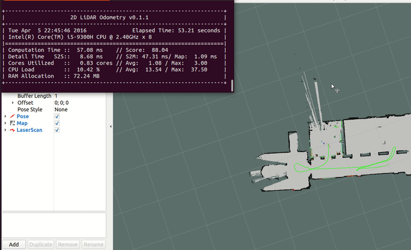
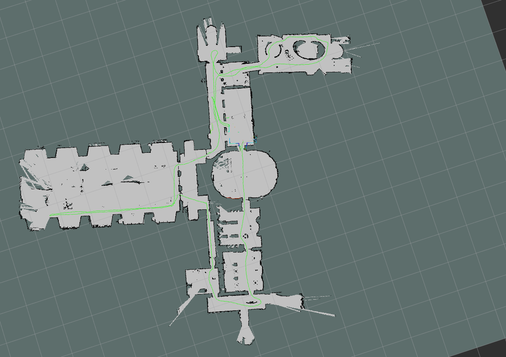

# 1. 2DSLAM
2D pure laser odometry, using Ceres as the optimizer, without utilizing the point cloud processing library PCL. Handwritten point cloud class, kd-tree, and a simple inter-frame matching algorithm. Employed various methods such as smart pointers and OpenMP to optimize the code.
## Preview 

| Mapping | Final Map |
| --- | --- |
|  |  |

# 6. Reference
* [项目基础](https://github.com/libing64/slam2d)
* cartographer

